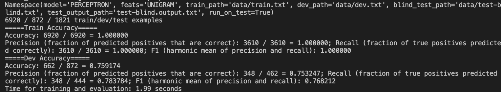
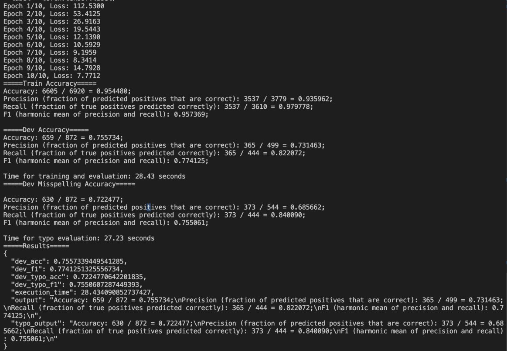
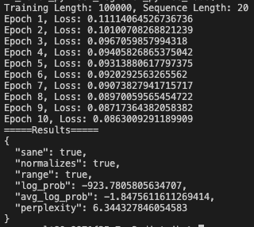

# Transformer-Language-Modeling-and-LLMs

## Linear Sentiment Classification

**Description:**

 
The main goal here is to extract features and training classifiers on text, and get a sense of what the standard machine learning workflow looks like (reading in data, training, and testing), how standard learning algorithms work, and how the feature design process goes. 

  

## Feedforward Neural Networks, Word Embeddings, and Generalization

**Description:**

 
The goal is to get experience training neural networks over text, play around with feedforward neural networks in PyTorch and see the impact of different sets of word vectors on the sentiment classification problem solved previously. 

  

## Transformer Language Modeling

**Description:**

 
The primary goal is to get hands-on experience implementing a Transformer language model from scratch. Understanding how these neural models work and building one from scratch helps understand not just language modeling, but also systems for many other applications such as machine translation.

  

## Code Files
Owing to UT Austin Honor Code, the model files will not be made public.
